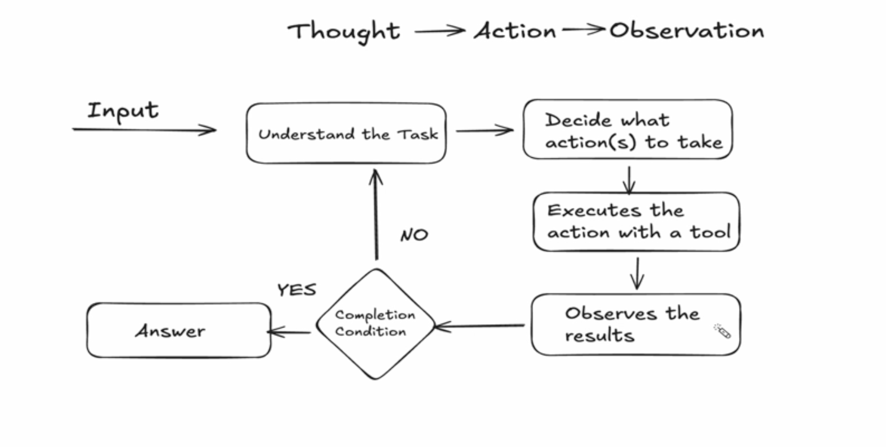

# Agents

`AI Agent` is an autonomous software system that uses AI to perceive its environment, reason through information, and take action to achieve a specific goal

Unlike standard chatbots that only generate text, agents use large language models (LLMs) as their "brain" to plan steps, use external tools, and execute tasks without human supervision


---

## How Agents Work (ReAct Framework)

"Action," "thought," and "observation" form `a continuous cycle (often called the ReAct framework) used in both human learning and artificial intelligence`

In short, you observe a situation, process it through thought, and execute an action, which creates a new observation



---

## Create an Agent

```python
create_agent(
    model = "gpt-4o", #init_chat_model("gpt-4o")
    tools = [tool_1, tool_2],
    system_prompt = """
        You're a helpful assistant that has tools for baking
    """,
    response_format = ToolStrategy(StructuredSchema),
    context_schema = ContextSchemaDefinition,
    state_schema = CustomState(AgentState),
    checkpointer = InMemorySaver, #PostgresSaver,
    middleware = [
        # Place agent middleware/guardrails here (e.g., logging, input filtering)
    ]
)
```

`model`: The AI "brain" being used (GPT-4o).
`tools`: The extra skills or functions the AI is allowed to use.
`system_prompt`: The instructions telling the AI who it is and how to behave.
`response_format`: The strict format the AI must use for its final answer.
`context_schema`: The template for background information the AI needs to know.
`state_schema`: The template for the AI’s short-term memory (what it tracks during the chat).`checkpointer`: The system that saves the conversation so the AI doesn't forget past messages.
`middleware`: Safety checks or logging tools that run in the background.