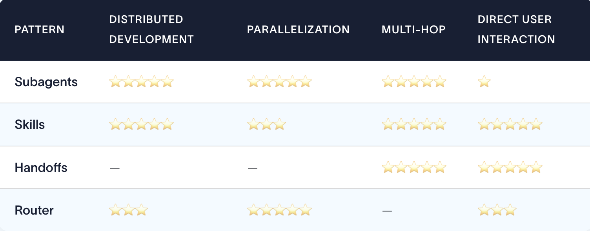

# Design Patterns

There are some design patterns to:

1. Router
2. Skills
3. [Subagents](sub-agents.md)
4. Handoffs

 

## Matching requirements to patterns

| Your Requirements | Pattern |
| :--- | :--- |
| Multiple distinct domains (calendar, email, CRM), need parallel execution | **Subagents** |
| Single agent with many possible specializations, lightweight composition | **Skills** |
| Sequential workflow with state transitions, agent converses with user throughout | **Handoffs** |
| Distinct verticals, query multiple sources in parallel and synthesize results | **Router** |

 

`Distributed development`: Can different teams maintain components independently?

`Parallelization`: Can multiple agents execute concurrently?

`Multi-hop`: Does the pattern support calling multiple subagents in series?

`Direct user interaction`: Can subagents converse directly with the user?

 

## Summary

| Pattern Name | Core Behavior | State / Memory Management | Best Used For |
| :--- | :--- | :--- | :--- |
| **1. Router** | A dedicated step classifies the query, triggers specialized vertical agents, and merges the results. | **Isolated / Stateless:** No shared history between parallel routes. | Querying distinct enterprise knowledge bases simultaneously. |
| **2. Subagents** | A main supervisor agent dynamically delegates subtasks to subagents and retains full context. | **Semi-Shared:** History is managed and filtered by the main supervisor. | Open-ended reasoning tasks requiring centralized management. |
| **3. Handoffs** | Agents execute their tasks sequentially and transfer control to another agent. | **Sequential Handoff:** State and message threads transfer cleanly down the chain. | Tiered customer support escalations or structured multi-stage pipelines. |
| **4. Skills** | A single conversational agent dynamically shifts its behavior by changing tools/instructions. | **Fully Shared:** Single state schema and message pool for the entire run. | Lightweight bots needing highly centralized but flexible skills. |

 

[Read for more information](https://www.langchain.com/blog/choosing-the-right-multi-agent-architecture)
