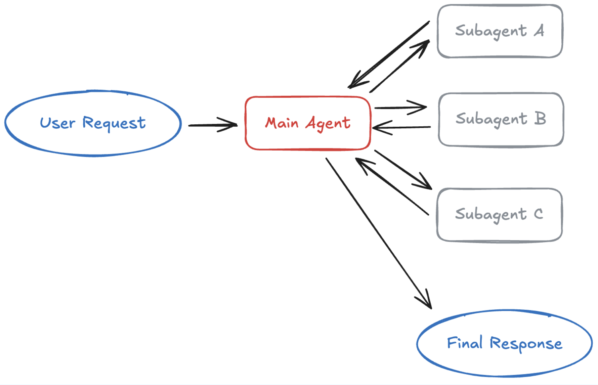

# Sub Agents Pattern



The **Sub-Agents Pattern** (also known as the Supervisor or Orchestrator-Worker pattern) organizes AI systems into a hierarchical structure where a main agent manages specialized, independent worker agents.

<br/>

When to use this,

```pwd
Want multiple domains but they aren't depend on each other

Centralized control

User don't want to talk to agents

Parallel execution

Clear seperation / testing and maintenance
```

<br/>

```pwd
Sub-Agent pattern (often called the supervisor or orchestrator pattern), sub agents are also agents and those sub-agents are functionally and programmatically treated as tools by the main agent.
```

<br/>

## Features

### 🎮 Centralized Control

* **Single Source of Truth:** A primary "Supervisor" or "Orchestrator" agent maintains the global state and conversation history.
* **Intent Routing:** The main agent is solely responsible for interpreting the user's goal, planning the required steps, and mapping tasks to the correct workers.
* **Strict Hierarchy:** Workers function in a hub-and-spoke model; they cannot directly communicate with, delegate to, or hand off tasks to other sub-agents.

### 🛠️ Sub-Agents as Tools

* **Functional Invocation:** The main agent views sub-agents exactly like traditional APIs, databases, or code interpreters.
* **Registry Execution:** Sub-agents are registered with explicit names and descriptions. The main agent calls them by passing a specific text payload to a target "task tool".
* **Configurable Workers:** Because they are encapsulated as tools, individual sub-agents can be customized with their own specialized prompts, distinct toolsets, or even entirely different underlying LLM models.

### 🔒 Context Isolation

* **Clean Context Windows:** Sub-agents spawn in separate, temporary execution tracks. They do not inherit the parent agent's accumulated conversation history.
* **Anti-Pollution:** Isolating conversations prevents "context bloat" or token spilling. Irrelevant or detailed debugging logs from one task won't leak into and confuse another worker's task.
* **Token Efficiency:** Keeping the parent's context window lean avoids performance degradation and drastically reduces token costs during complex operations.

### 🔄 Result Synthesis

* **Aggregation:** Once a sub-agent completes its objective, it formats the findings into a structured output (like JSON) and returns it to the main agent.
* **Verification:** The orchestrator agent acts as a quality gate, verifying the accuracy of the sub-agent’s work before finalizing the answer.
* **Parallel Fan-In:** If multiple independent sub-agents are executed at the same time to speed up processing, the orchestrator compiles and merges all their data into one unified final response.

### 🙅 No Direct User Interactions

* **Conversational Barrier:** Sub-agents operate purely in the background; the end-user never sees their intermediate chain-of-thought or raw execution loops.
* **Enforced Handbacks:** A sub-agent cannot hijack or pivot the main user conversation. It must execute its specific assignment and immediately return control back to the orchestrator.
* **Unified Interface:** The user experiences a seamless, single-agent interface while a hidden multi-agent workforce handles complex computing behind the scenes.

<br/>

## Design Decisions

- Sync Vs Async
- Sub Agent Inputs
- What the main agent sent back

<br/>

## Benefits and Tradeoffs

| Benefits | Trade-offs |
| :--- | :--- |
| **Clear separation of concerns:** Each agent focuses on an isolated domain. | **Extra LLM calls:** Orchestration loops multiply total network requests. |
| **Centralized orchestration:** A single manager handles routing, planning, and state. | **High token cost:** Multi-turn processing increases cloud infrastructure bills. |
| **Context isolation:** Workers stay lean without inheriting entire history. | **No direct interaction:** Workers cannot ask users clarifying questions mid-task. |
| **Parallel execution:** Multiple independent sub-agents can run tasks at once. | **Stateless workers:** Sub-agents lose context instantly when tasks finish. |
| **Independent development:** Teams can build, prompt, and update agents separately. | **High latency:** Sequential multi-agent steps slow down execution speed. |
| **Modular maintenance:** Fixing one worker does not break the other agents. | **Synthesis complexity:** Managers struggle to merge conflicting worker data. |
| **Easier testing:** Individual agent tools accept deterministic inputs/outputs. | **Routing errors:** The orchestrator may invoke the wrong sub-agent tool. |
| **System scalability:** New features drop in by registering new worker tools. | |
| **Better tool selection:** Narrow tool sets prevent LLM confusion. | |
