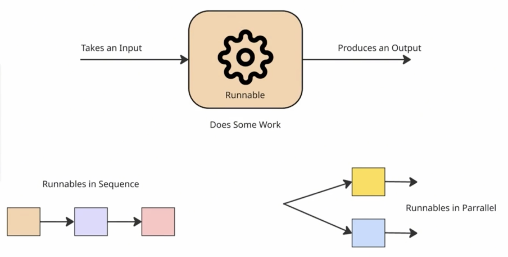
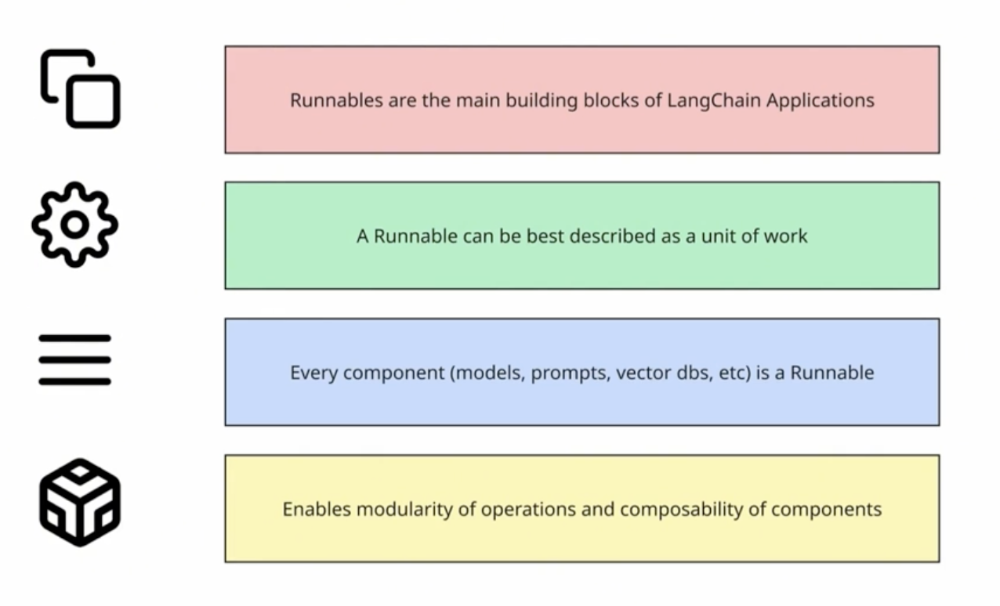
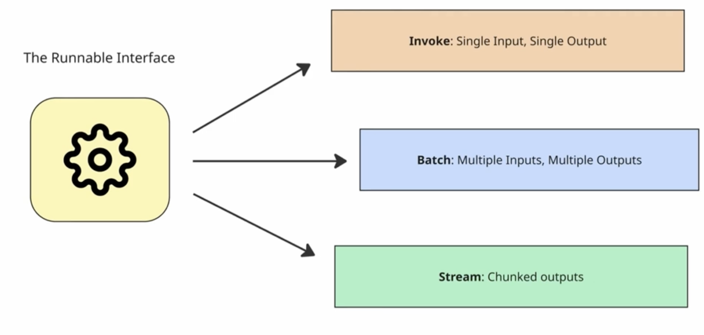
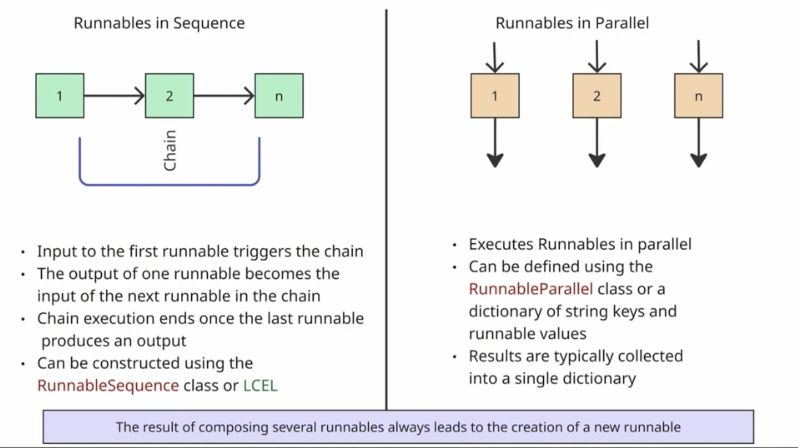
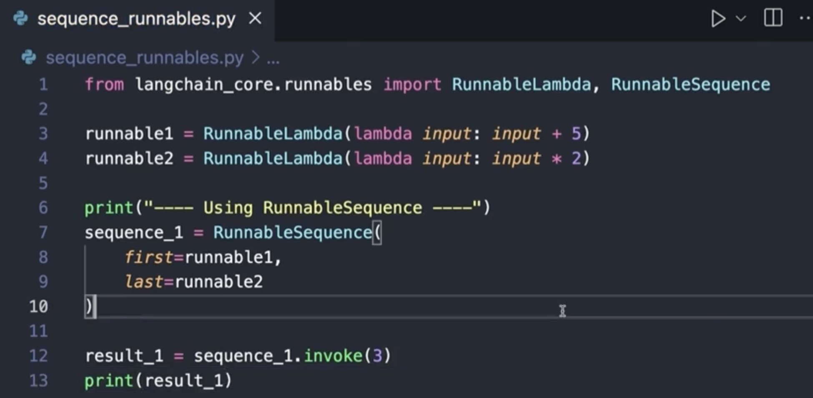
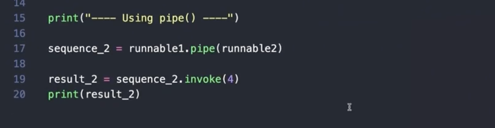
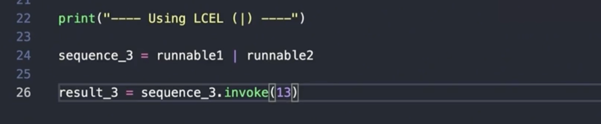
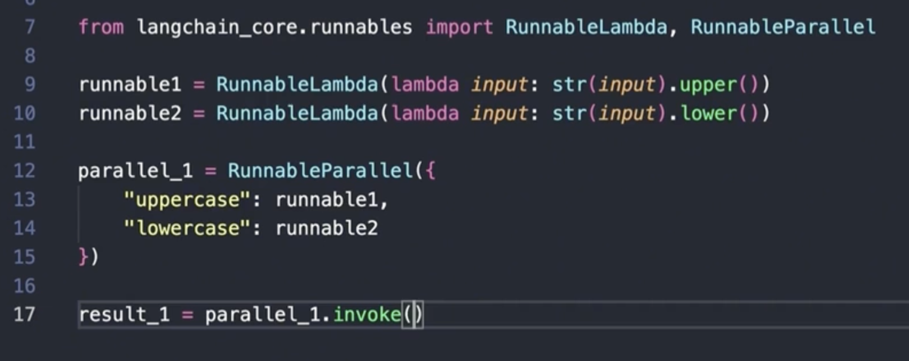
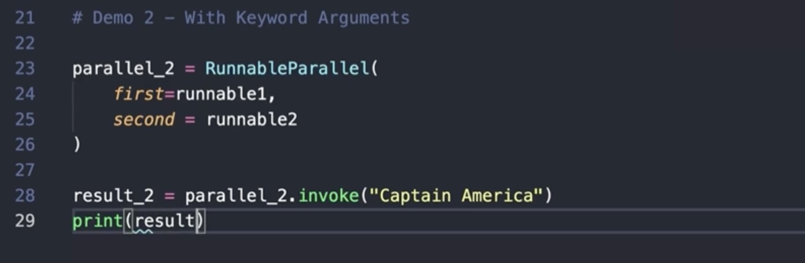

# Runnables

`Runnables is a standardized unit of work that defines how a component receives input, processes data, and returns an output`

 

 

---

## Core Methods of the Runnable Interface

`invoke`: Processes a single input and returns a single output synchronous

`ainvoke`: The asynchronous equivalent of the invoke method

`batch`: Processes a list of multiple inputs concurrently

`abatch`: The asynchronous equivalent of the batch method

`stream`: Streams back chunks of the response as they are generated

`astream`: The asynchronous equivalent of the stream method

---

## Runnables Types

 

### Sequence Runnables

Using runnables sequence

 

Using pipes

 

Using LCEL

 

### Parrarel Runnables

Using runnables sequence

 

Using pipes

 
