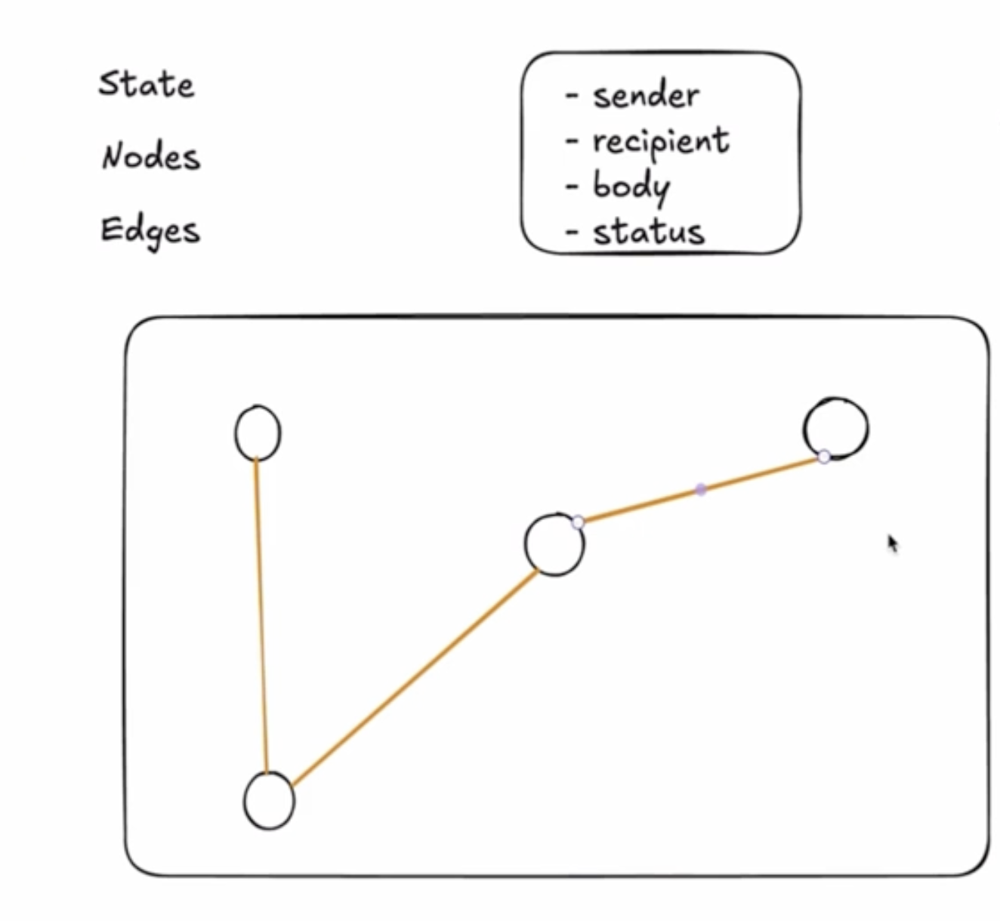
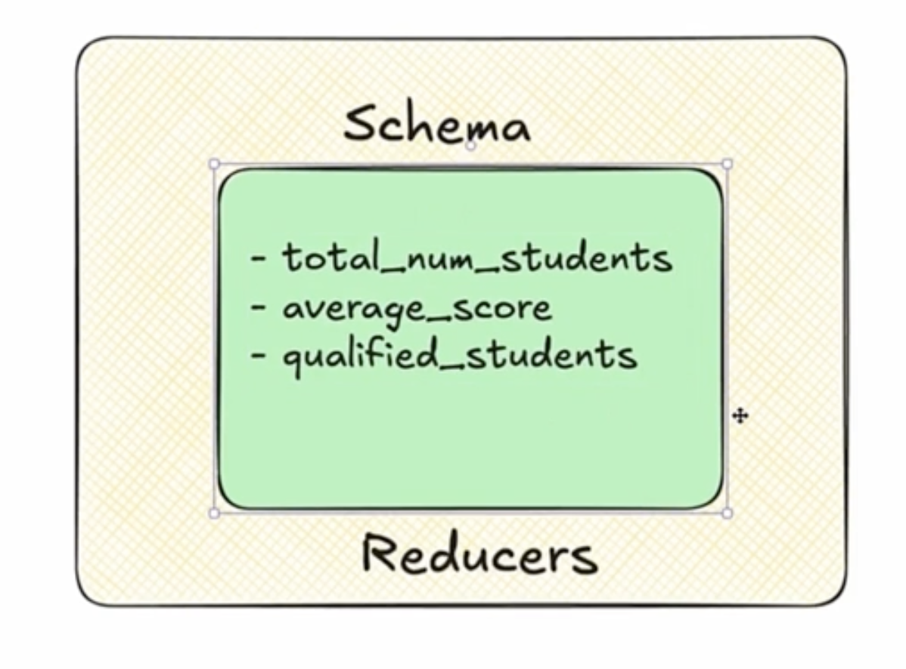
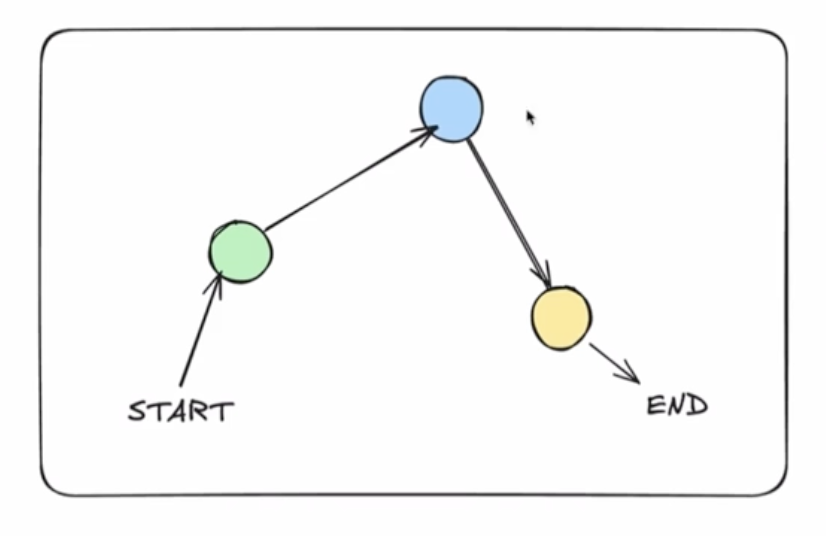
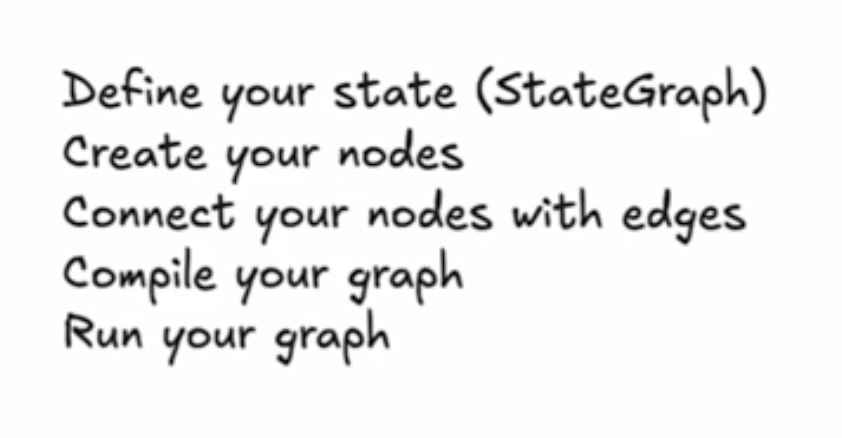

# LangGraph API

State machine of LangChain

<br/>

## Core Components

This state machines are built using three primary elements:



`State`:
A shared data structure that acts as the application’s persistent memory. It holds context and variables that are updated as the workflow progresses.



- `Schema` is the all the variables that include in the state graph
- `Reducers` are the one who update the states. Each state variable has it's own reducer

<br/>

`Nodes`:
Individual functions or AI agents that perform specific tasks (e.g., executing a web search, querying a database, or running an LLM prompt). | `Action Takers of Agents` | just functions | every single node takes the state as an argument

<br/>

`Edges`:
The transition paths that dictate which node runs next, including conditional routing (like if/else statements) | The lines that connects nodes each other | Doing conditional operations



<br/>

### How to create and run your graph



```python
from langgraph.graph import StateGraph, START, END
from typing import Annotated, List, TypedDict
from langgraph.graph.message import add_messages

# 1. Define our state

# 2. Create our nodes

# 3. Link nodes with edges

# 4. Compile Graph

# 5. Run Graph
```
