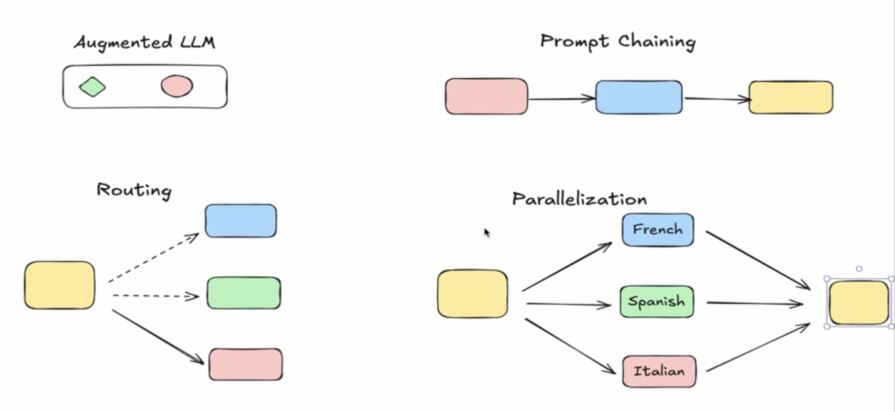
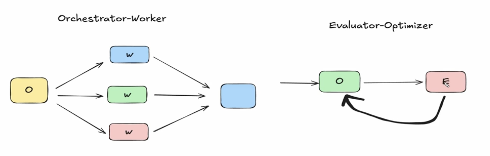

# LangGraph

`LangGraph` is an open-source framework created by LangChain designed to build stateful, multi-step AI applications and multi-agent systems.

 

## Agents

[Read More about Agents](../agents/index.md)

 

## Why Use It over Standard LangChain?

While LangChain is great for simple, sequential prompt chains, it struggles with complex tasks requiring iteration. LangGraph allows for cyclical graphs, meaning your AI agents can execute loops, self-correct errors, and refine their outputs.It also supports `Human-in-the-Loop (HITL) interaction`, pausing workflows so a human can approve or edit an agent's decision before it proceeds.

 

## When to use Multi Agent System

- Have more tools - When tool overload problem
- Context window limits - When have long conversations
- Loose Context - When we loose quality of the context
- Sequencial contstraints - When we need have a sequence
- Parallelization needs - When we have pararel tasks
- Organizational boundaries - When system looks like organizational structure

 

## Anotomy of an Agentic System

[Read More](../others/anatomy_of_agentic_workflows.md)

 

## Agentic Design Patterns

There are some design patterns to:

| Pattern Name | Core Behavior | State / Memory Management | Best Used For |
| :--- | :--- | :--- | :--- |
| **1. Router** | A dedicated step classifies the query, triggers specialized vertical agents, and merges the results. | **Isolated / Stateless:** No shared history between parallel routes. | Querying distinct enterprise knowledge bases simultaneously. |
| **2. Subagents** | A main supervisor agent dynamically delegates subtasks to subagents and retains full context. | **Semi-Shared:** History is managed and filtered by the main supervisor. | Open-ended reasoning tasks requiring centralized management. |
| **3. Handoffs** | Agents execute their tasks sequentially and transfer control to another agent. | **Sequential Handoff:** State and message threads transfer cleanly down the chain. | Tiered customer support escalations or structured multi-stage pipelines. |
| **4. Skills** | A single conversational agent dynamically shifts its behavior by changing tools/instructions. | **Fully Shared:** Single state schema and message pool for the entire run. | Lightweight bots needing highly centralized but flexible skills. |

 

## Workflows

These are the main commin workflow types that we have in the langchain

These are,

- [Augmented LLM](../workflows/augmented_llm.md)
- [Prompt Chianning](../workflows/prompt_chaining.md)
- [Routing](../workflows/routing.md)
- [Parallelization](../workflows/parallelization.md)
- [Ochestrator Worker](../workflows/ochestrator.md)
- [Evaluator-Optimizer](../workflows/evaluator.md)
