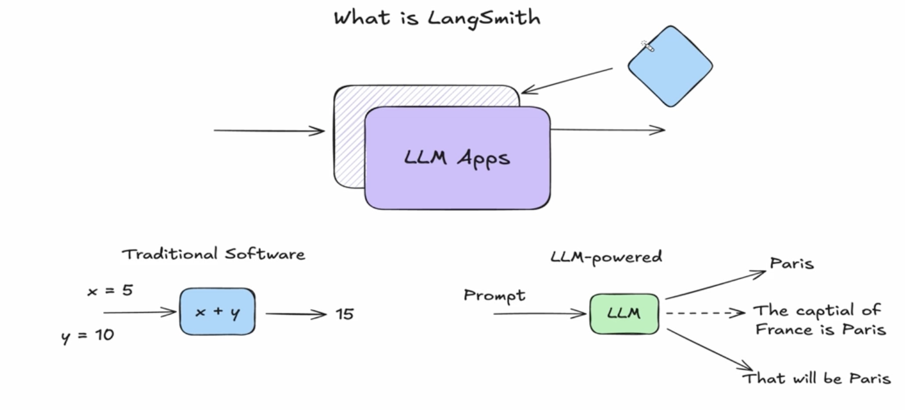
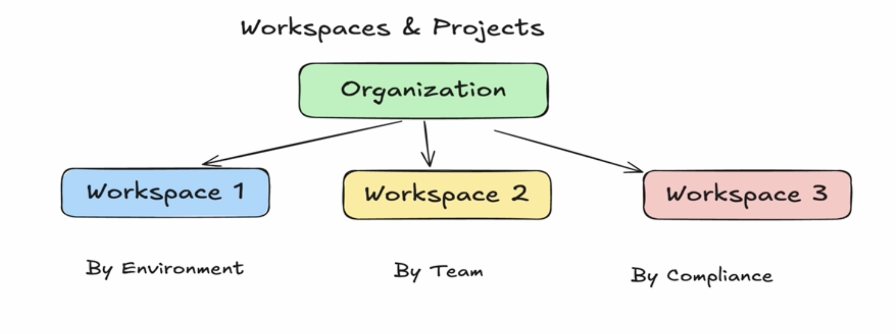
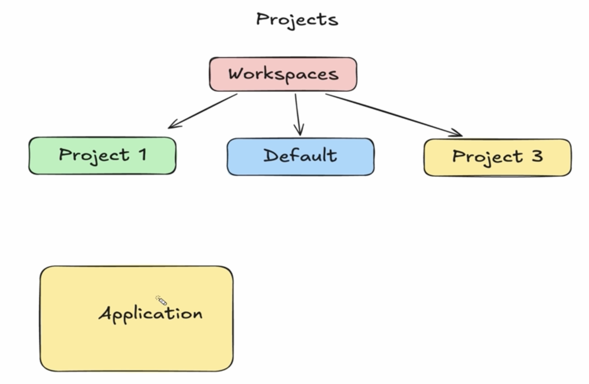

# LangSmith

`LangSmith` is a comprehensive platform built by the LangChain Platform team for observing, evaluating, and deploying LLM applications and AI agents

Although created by the makers of LangChain, it is framework-agnostic and works with any stack (such as OpenAI, Anthropic, or LlamaIndex)

 

## Features

`Observability & Tracing`: Gives full visibility into every step an agent or model takes, tracking token counts, latency, costs, and complete conversation traces.

`Evaluation & Testing`: Lets you run test suites, set up LLM-as-a-judge evaluators, and compare performance results side-by-side before updating production code.

`Debugging`: Helps pinpoint root causes of errors, hallucinations, or infinite loops by letting you inspect exact inputs and outputs at every layer.

`Deployment`: Provides a managed workflow runtime and infrastructure to handle production agents at scale.

`Prompt Management`: Give freedom for fully manage prompt templates

`Feedback Collection`

---

