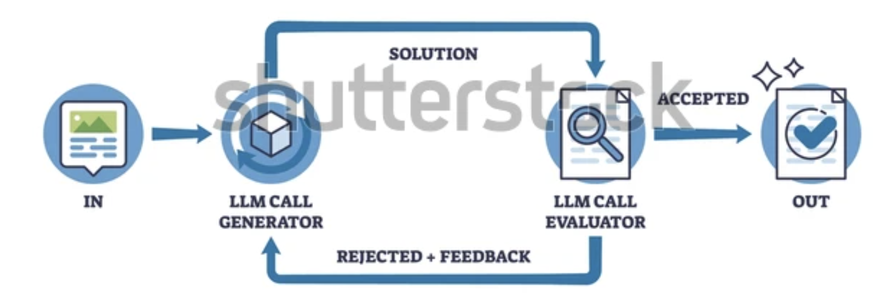

# Evaluator-Optimizer

An `Evaluator-Optimizer` AI is a self-correcting workflow pattern using a generator, an evaluator, and an iterative loop to refine outputs without human intervention

 

## Core Components

`Generator (Creator)`: Produces the initial draft or solution based on the task

`Evaluator (Judge)`: Reviews the work against clear, predefined rules or criteria

`Optimizer (Refiner)`: Uses feedback from the evaluator to fix mistakes and improve the next version

 

## How the Loop Works

- The generator makes a first attempt
- The evaluator reads the output and gives a score or specific notes on what is wrong
- If the work fails the test, it goes back to the generator with the feedback
- The loop keeps going until the evaluator gives a passing grade or a set limit is reached
