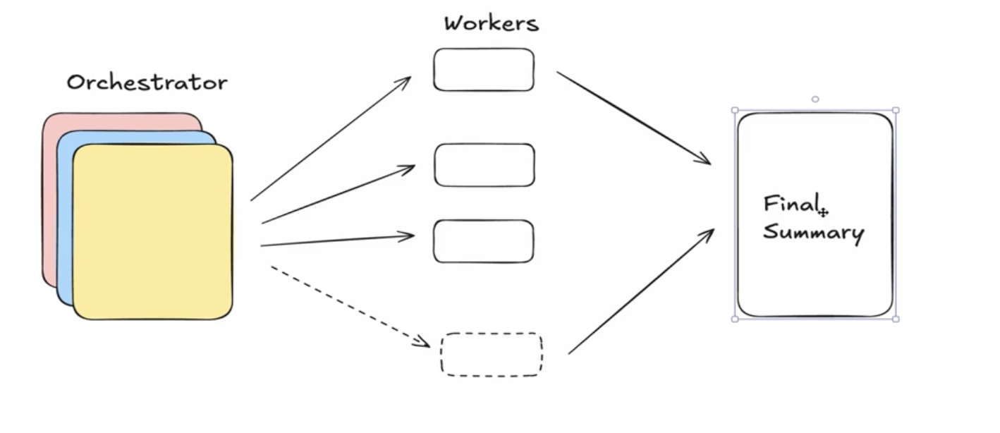
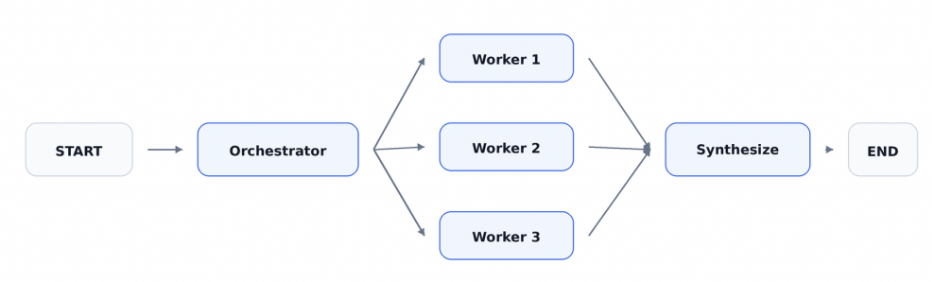

# Ochestrator Worker

`The Orchestrator-Worker model` is a task-management design pattern where a central manager divides a large job into smaller pieces, hands them out to helper components, and then puts all the pieces back together

It features an orchestrator, specialized workers, and a synthesis step.

 

## Core Components

`The Orchestrator`: The brain or coordinator that looks at the main goal, splits it into clear subtasks, and assigns them to the right helpers.

`The Workers`: Simple, specialized helpers that focus on doing one specific job very well using their own tools or skills.

`The Synthesizer`: The final step where the manager collects all the small answers from the helpers and joins them into one smooth final result.

 

## Features

- Scale dynamically
- Handle dynamic complexity
- Parralel processing
- Coordination
- Seperation of concerns
